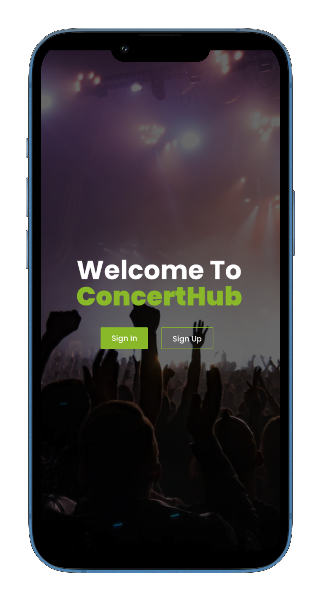

<div align="center">
  
</div>

<h1 style="text-align: center; font-size: 40px;"> ConcertHub 🎵🎤🎶 </h1>
## 🎵 Table of Contents 🎵

- [🎵 Table of Contents 🎵](#-table-of-contents-)
- [ConcertHub 🎵🎤🎶](#concerthub-)
  - [🎶 Built With 🎶](#-built-with-)
    - [Tech Stack 🎶](#tech-stack-)
    - [Key Features 🎶](#key-features-)
  - [🎸 Live Demo 🎸](#-live-demo-)
  - [🎹 Getting Started 🎹](#-getting-started-)
    - [Prerequisites 🎹](#prerequisites-)
    - [Setup 🎹](#setup-)
    - [Install 🎹](#install-)
    - [Usage 🎹](#usage-)
  - [🎷 Authors 🎷](#-authors-)
  - [🎺 Future Features 🎺](#-future-features-)
  - [🎻 Contributing 🎻](#-contributing-)
  - [⭐️ Show your support ⭐️](#️-show-your-support-)
  - [🎵 Acknowledgments 🎵](#-acknowledgments-)
  - [🎼 License 🎼](#-license-)

---

## ConcertHub 🎵🎤🎶

ConcertHub is a platform where music enthusiasts can discover upcoming concerts, book tickets, and explore their favorite artists. Experience the world of music like never before with ConcertHub!

<div style="display: flex; align-items: center;">


</div>

### 🎶 Built With 🎶

#### Tech Stack 🎶

<details>
  <summary>Client</summary>
  <ul>
    <li><a href="https://reactjs.org/">React.js</a></li>
  </ul>
</details>

#### Key Features 🎶

- Explore upcoming concerts and events.
- Book tickets for your favorite artists' performances.
- See to what concerts you have reserved.
- At the admin side, the admin can create a new concert and also delete a concert previously created.

---

## 🚀 Live Demo 🎸

Visit the [Live Demo](https://www.concerthub.com) of ConcertHub to experience the joy of music!

---

## 💻 Getting Started 🎹

### Prerequisites 🎹

To run this project, you need the following:

- A web browser (Safari, Chrome, Opera, etc...)
- A code editor (Sublime Text, VS Code, WebStorm, etc...)
- Necessary packages (git, node and npm)

Check if the packages are installed by running the following command in the terminal:

```
$ git --version
$ node --version
$ npm --version
```

## Setup 🎹 

Clone this repository into your desired folder by following the following steps.

### Install 🎹
In the terminal, go to your file directory and run this command:
```
$ cd my-folder
$ git clone https://github.com/Stephen-Adom/concert-react-front-end.git
```
### Initialize 🎹

In the terminal run this command:
```
$ cd concert-react-front-end.git
$ npm start
```
The website will automatically start on your default web browser.

## 👥 Authors 🎷  <a name="authors"></a>

👤 **Stephen Addae**

- GitHub: [@Stephen-Adom](https://github.com/Stephen-Adom)
- LinkedIn [Stephen Addae](https://www.linkedin.com/in/stephen-addae/)

👤 **Derbal Mohammed El Amine**

- GitHub: [@AmineDerbal](https://github.com/AmineDerbal)
- LinkedIn: [Mohammed El Amine Derbal](https://www.linkedin.com/in/mohammed-el-amine-derbal-4038541b6/)

👤 **Oussama Elabdioui**

- GitHub: [@codedit334](https://github.com/codedit334)
- Twitter: [@oussedit](https://twitter.com/oussedit)
- LinkedIn: [Oussama Elabdioui](https://www.linkedin.com/in/oussama-elabdioui-4677a41b6/)

### 👤 **Aman Worku**:
- GitHub: [@Aman_on_GitHub](https://github.com/AmanWorku)
- Twitter: [@Aman_on_Twitter](https://twitter.com/Amexworku)
- LinkedIn: [@Aman_on_LinkedIn](https://www.linkedin.com/in/aman-worku-tsegaw/)


## 🔭 Future Features <a name="future-features"></a>

- Deployement
- Add more features.

<p align="right">(<a href="#readme-top">back to top</a>)</p>

<!-- CONTRIBUTING -->

## 🤝 Contributing <a name="contributing"></a>

Contributions, issues, and feature requests are welcome!

Feel free to check the [issues page](https://github.com/Stephen-Adom/concert-rails-back-end/issues).

<p align="right">(<a href="#readme-top">back to top</a>)</p>

<!-- SUPPORT -->

## ⭐️ Show your support <a name="support"></a>

If you like this project you can give it a star, that would be nice.

<p align="right">(<a href="#readme-top">back to top</a>)</p>

## 🙏 Acknowledgments <a name="acknowledgements"></a>

- We would really like to acknowledge Microverse for giving us this platform of working on this amazing project.
- We would like to thank [Murat Korhmaz](https://www.behance.net/gallery/26425031/Vespa-Responsive-Redesign) for the mesmerizing design.

<p align="right">(<a href="#readme-top">back to top</a>)</p>

<!-- LICENSE -->